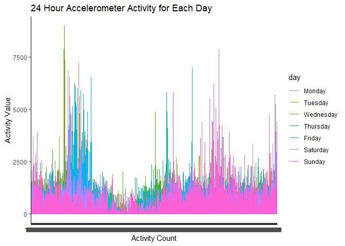
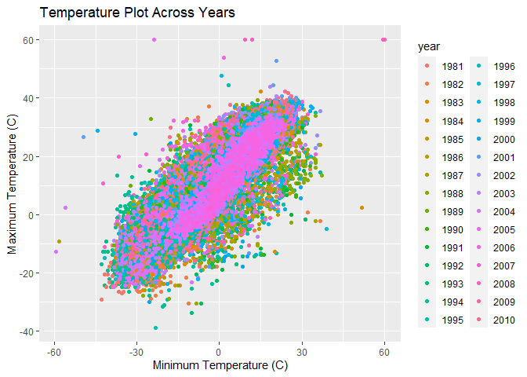

p8105_hw3_hw2850
================
Haoyang Wang
2022-10-08

\##problem 2

``` r
library(tidyverse)
```

    ## ── Attaching packages ─────────────────────────────────────── tidyverse 1.3.2 ──
    ## ✔ ggplot2 3.3.6      ✔ purrr   0.3.4 
    ## ✔ tibble  3.1.8      ✔ dplyr   1.0.10
    ## ✔ tidyr   1.2.0      ✔ stringr 1.4.1 
    ## ✔ readr   2.1.2      ✔ forcats 0.5.2 
    ## ── Conflicts ────────────────────────────────────────── tidyverse_conflicts() ──
    ## ✖ dplyr::filter() masks stats::filter()
    ## ✖ dplyr::lag()    masks stats::lag()

``` r
library(dplyr)
accel = read_csv("./accel_data.csv") %>% 
  janitor::clean_names() %>% 
  mutate_if(is.double, as.numeric)
```

    ## Rows: 35 Columns: 1443
    ## ── Column specification ────────────────────────────────────────────────────────
    ## Delimiter: ","
    ## chr    (1): day
    ## dbl (1442): week, day_id, activity.1, activity.2, activity.3, activity.4, ac...
    ## 
    ## ℹ Use `spec()` to retrieve the full column specification for this data.
    ## ℹ Specify the column types or set `show_col_types = FALSE` to quiet this message.

``` r
accel_tidy = 
  pivot_longer(
    accel,
    activity_1:activity_1440,
    names_to = "activity",
    values_to = "activity_data",
    names_prefix = "activity_"
  ) %>% 
  mutate(.data = ., 
         week_type = if_else(day %in% c("Saturday", "Sunday"), "weekend", "weekday"),
         day = fct_relevel(day, "Monday", "Tuesday", "Wednesday", "Thursday", "Friday", "Saturday", "Sunday")) 
```

The tidied dataset has variables activity, activity_data, day, day_id,
week, week_type. The dataset has a size of 50400, 6.

``` r
accel_total = accel_tidy %>%  
  group_by(day, week) %>% 
  summarize(activity_day = sum(activity_data)) %>% 
  mutate(week = as.character(week))
```

    ## `summarise()` has grouped output by 'day'. You can override using the `.groups`
    ## argument.

``` r
accel_table = accel_total %>% table
```

``` r
ggplot(accel_total, aes(x = day, y = activity_day, group = week, color = week))+
  geom_line()+ 
  scale_y_continuous(
    breaks = c(100000, 400000, 700000),
    labels = c("100000", "400000", "700000"))+
  theme_classic()+
  labs(
    title = "Accelerometer Each Day Data in Five Weeks",
    x = "Day",
    y = "Accelerometer 24-hour Activity",
  )
```

<!-- -->
From the graph trend, Accelerometer 24 hour activity is relatively
stable in Tuesday, Wednesday.

``` r
ggplot(accel_tidy, aes(x = activity, y = activity_data, group = day, color = day))+
  geom_line()+
  theme_classic()+
  labs(
    title = "24 Hour Accelerometer Activity for Each Day",
    x = "Activity Count",
    y = "Activity Value",
  )
```

<!-- --> The
Accelerator activity of each day fluctuates across a day.

\##problem3

``` r
library(p8105.datasets)
library(dplyr)
library(rnoaa)
```

    ## Registered S3 method overwritten by 'hoardr':
    ##   method           from
    ##   print.cache_info httr

``` r
data("ny_noaa")

ny_noaa_tidy = ny_noaa %>% 
  janitor::clean_names() %>% 
  mutate(
    tmax = as.numeric(tmax),
    tmin = as.numeric(tmin),
    tmax = tmax/10,
    tmin = tmin/10
  ) %>% 
  separate(date, into = c("year","month","day"))

ny_noaa_tidy %>% 
  count(snow)
```

    ## # A tibble: 282 × 2
    ##     snow       n
    ##    <int>   <int>
    ##  1   -13       1
    ##  2     0 2008508
    ##  3     3    8790
    ##  4     5    9748
    ##  5     8    9962
    ##  6    10    5106
    ##  7    13   23095
    ##  8    15    3672
    ##  9    18    3226
    ## 10    20    4797
    ## # … with 272 more rows

The most commonly observed value for snowfall is 0.

``` r
ny_max = filter(
  ny_noaa_tidy, month %in% c("01", "07")) %>% 
  mutate(
    month = recode(month, `01` = "January", `07` = "July")
  ) %>% 
  select(.data = ., id, year, month, tmax) %>% 
  group_by(id, year, month) %>% 
  summarize(tmax_mean = mean(tmax, na.rm = T)) 
```

    ## `summarise()` has grouped output by 'id', 'year'. You can override using the
    ## `.groups` argument.

``` r
ggplot(ny_max, aes(x = year, y = tmax_mean, group = id))+
  geom_line(aes(color = year))+
  scale_x_discrete(
    breaks = c(1980, 1990, 2000, 2010),
    labels = c("1980", "1990", "2000", "2010")
  )+
  theme_classic()+
  facet_grid(. ~ month)+
  labs(
    title = "Max Temperature in January and in July in each NYC Subway Station Across Years",
    x = "Year",
    y = "Average Maximum Temperature (C)"
  )
```

    ## Warning: Removed 5640 row(s) containing missing values (geom_path).

<!-- --> The
average maximum temperature fluctuates in January between -10 and 10
degree Celsius and fluctuates in July between 20 and 40 degree Celsius.
There are few outliers which could denote extreme weather.

``` r
ggplot(ny_noaa_tidy, aes(x = tmin, y = tmax), group = week)+
  geom_point(aes(color = year))
```

    ## Warning: Removed 1136276 rows containing missing values (geom_point).

<!-- -->

``` r
library(ggridges)
ny_snow = ny_noaa_tidy %>% 
  group_by(id, year, snow) %>% 
  summarize(snow = sum(snow)) %>% 
  filter(snow > 0 & snow<100)
```

    ## `summarise()` has grouped output by 'id', 'year'. You can override using the
    ## `.groups` argument.

``` r
ggplot(ny_snow, aes(x = snow, y = year))+
  geom_density_ridges(scale = .85)+
  labs(
    title = "Snowfall From 0 to 100 By Years",
    x = "Snowfall Value",
    y = "Years",
  )
```

    ## Picking joint bandwidth of 5.39

<!-- -->
